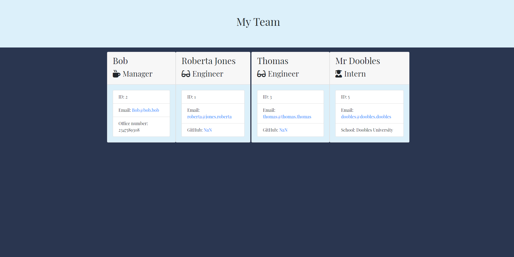

# Team-Profile-Generator [](https://opensource.org/licenses/MIT)

## Table of Contents
- [User Story](#user-story)
- [Business Context](#business-context)
- [How Team Profile Generator Works](#how-team-generator-works)
- [Webpage Screenshots](#webpage-screenshots)
- [Webpage Demo](#webpage-demo)
- [Questions](#questions)

## User Story
```
AS A manager
I WANT to generate a webpage that displays my team's basic info
SO THAT I have quick access to emails and GitHub profiles
```

## How Team Profile Generator Works
Team Profile Generator is a software engineering team generator command line application. Team Profile Generator prompts the user with questions using inquirer regarding the team manager, engineers, and interns. The user can input as many team members as they would like. Once the user finishes and selects the "no more employees to add" prompt, then the application will render an HTML file that displays a neatly formatted team roster based on the information provided by the user.

## Webpage Screenshot


## Webpage Demo 
https://youtu.be/NJBMa5vVKyU

## Questions
If you have any questions, feel free to contact me at: ktlnn.nguyen@gmail.com